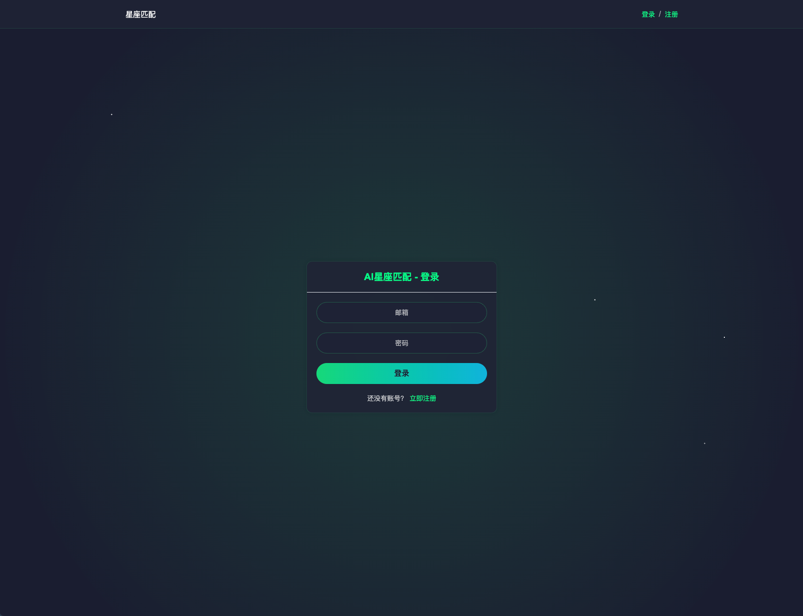

# StarMatchAI
PS：纯cursor实现
StarMatchAI 是一个基于AI大模型人工智能的星座匹配分析系统，能够为用户提供专业、详细的星座配对分析。

后续慢慢增加功能...

## 页面展示





## 功能特点

- 智能匹配分析：基于先进的AI模型，提供准确的星座匹配评分
- 多维度解读：包含整体分析、优势特点、潜在问题和相处建议
- 实时响应：采用流式响应技术，提供即时的分析反馈
- 优雅展示：使用打字机效果，让分析结果展示更加生动
- 数据缓存：使用Redis进行数据缓存，提升系统性能

## 技术栈

### 后端
- Spring Boot 2.7.x
- Java 8
- Redis
- OpenAI API

### 前端
- Vue 3
- Element Plus
- Vite
- Fetch API

## 快速开始

### 环境要求
- JDK 1.8+
- Maven 3.6+
- Redis 6.0+
- Node.js 16+

### 后端启动
1. 配置 application.yml 中的相关参数（Redis、OpenAI API等）
2. 运行 Spring Boot 应用：
```

## 使用说明

1. 访问系统首页
2. 输入两个人的出生日期
3. 点击"开始匹配"按钮
4. 等待系统生成匹配分析结果
5. 查看详细的匹配报告

## 开发计划

- [ ] 添加更多星座匹配算法
- [ ] 优化AI模型响应速度
- [ ] 增加历史记录功能
- [ ] 支持更多的数据可视化
- [ ] 添加用户反馈系统

## 贡献指南

1. Fork 本仓库
2. 创建新的功能分支
3. 提交你的更改
4. 发起 Pull Request

## 许可证

[MIT License](LICENSE)

## 联系方式

如有问题或建议，欢迎提出 Issue 或 PR。